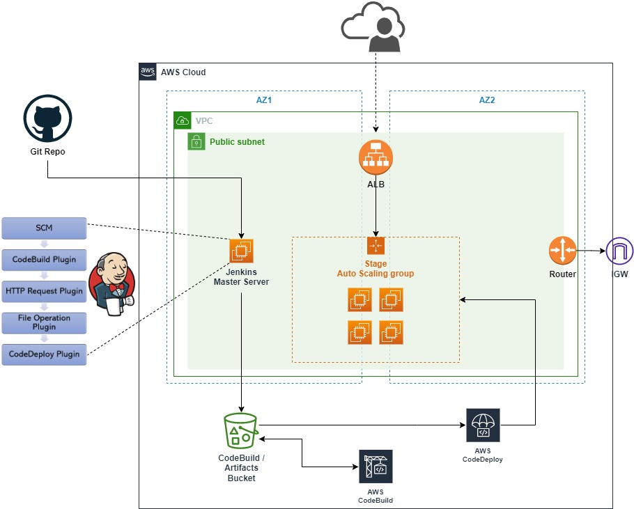

# aws-labs-jenkins-codedeploy
>This project is a rebuilt of following AWS blog.
>https://aws.amazon.com/blogs/devops/setting-up-a-ci-cd-pipeline-by-integrating-jenkins-with-aws-codebuild-and-aws-codedeploy/

## Step 1
### Provisioning required resources using CloudFormation template. Following resources will be created.
- VPC, RT, IGW, 2 Public Subnets
- AutoScalingGroup to spawn Stage instances fronted by ALB
- Fresh Jenkins Server running on Amazon Linux AMI
- CodeBuild Project
- CodeDeploy Application / Deployment Group
- S3 Bucket to store source and artifacts

## Step 2
### Create IAM Jenkins user for the project. 
- Go to IAM console
- Add new user with only `Access Key`
- Attach `JenkinsPolicy` to the newly added user. The policy includes every permissions required for Jenkins project to interact with CodeBuild, CodeDeploy and Put/Get objects from S3 Bucket
- Note down access key and secret

## Step 3
### Configure Jenkins Server
- SSH to server to get password using cmd
~~~bash
sudo more /var/lib/jenkins/secrets/initialAdminPassword
~~~
- Finish setting up admin information
- Install plugins
    - CodeBuild Plugin
    - CodeDeploy Plugin
    - HTTP Request
    - File Operation

## Step 4
### Create Freestyle Project
- Provide Git Repo URL in SCM section. Example Python Flask Webpage repo.
~~~
https://github.com/psumranchit/flask-demo-for-jenkins-lab.git
~~~
- Build Trigger to poll SCM using cron. For example,
~~~
H/2 * * * *
~~~
- Set Build Environment to **delete workspace before build starts**
- Add AWS CodeBuild using `Add Build Step`
- Provide Access Key / Secret Key noted down from **Step 2** for `Manually specify access and secret keys`
- Project Configuration
    - Specify region
    - Get project name from CloudFormation Output tab. For example  > MyProject-build
- Select **Use Jenkins Source**
- Add File Operation using `Add Build Step`
    - Add `File Delete`
    - Put **\*** in **include file pattern**
- Add HTTP Request using `Add Build Step`
    - Get S3 Bucket URL from CloudFormation Output
    - Set "Ignore SSL errors?" to **Yes**
    - Click advance and put "codebuild-artifact.zip" in Output Response
- Add File Operation using `Add Build Step`. This time to unzip artifact and delete zip
    - Add **unzip** and put `codebuild-artifact.zip` in Zip File
    - Add **File Delete** and put `codebuild-artifact.zip` in Include File Pattern
- Add AWS CodeDeploy using add `post-build action`
    - Provide **CodeDeploy Application Name, CodeDeploy Deployment Group and CodeDeploy Deployment Config** using output from CloudFormation
    - Select Region
    - Provide **S3 BucketName** using output from CloudFormation
    - Select `Deploy Revision`
        - Select `Wait deployment to finish?`
        - Select `Use Access/Secret keys` and provide same keys from **Step 2**
- Click `Save`

## Diagram

